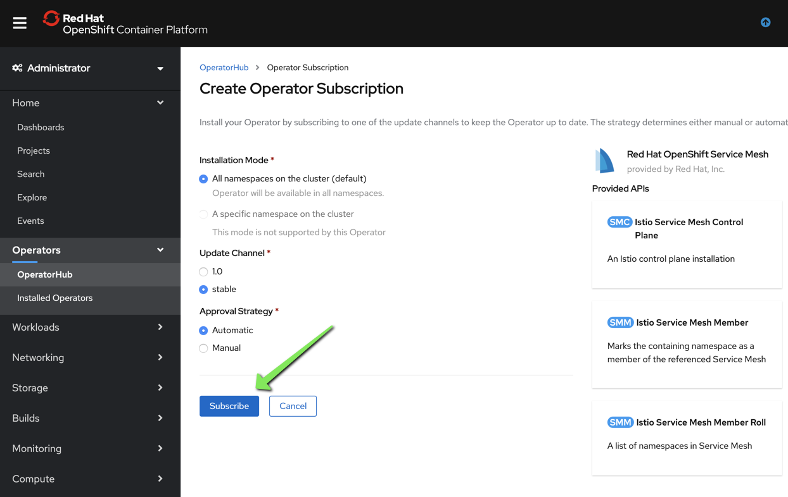
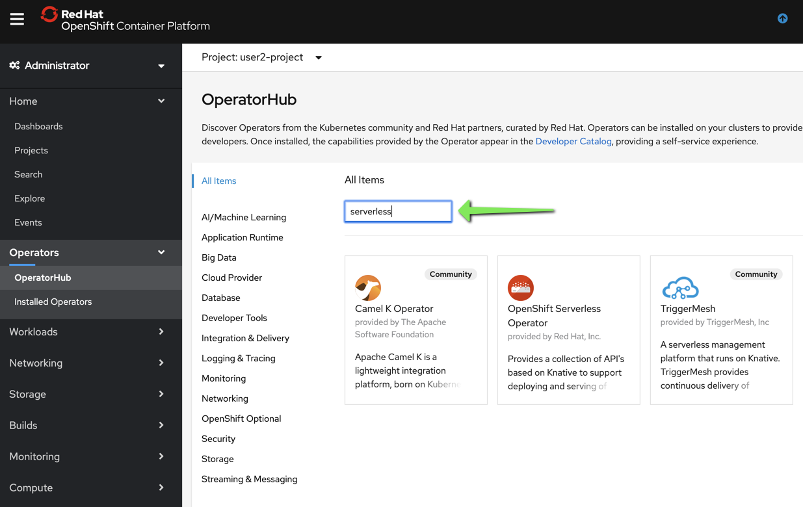
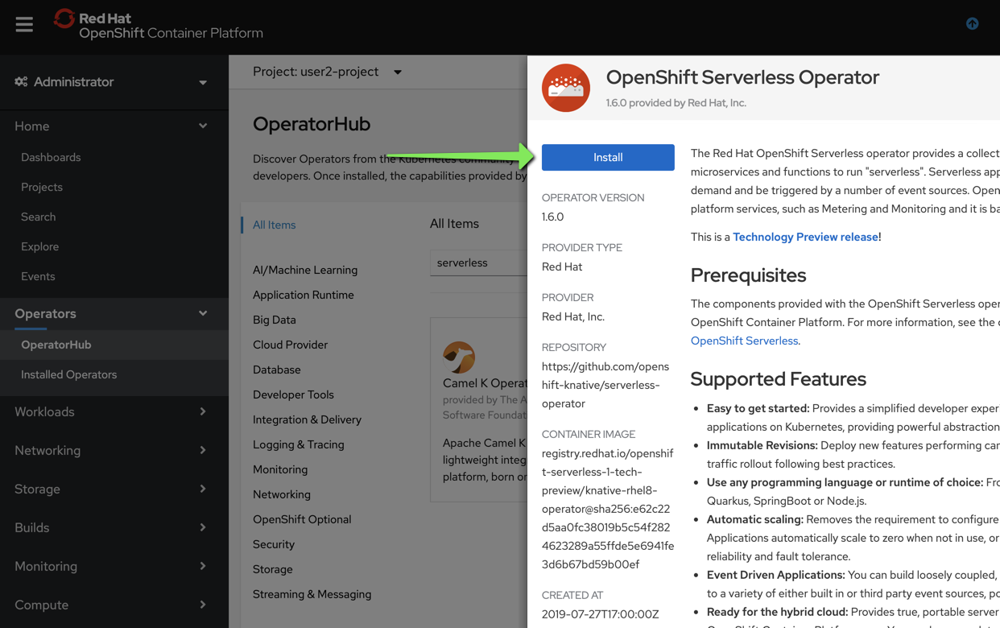
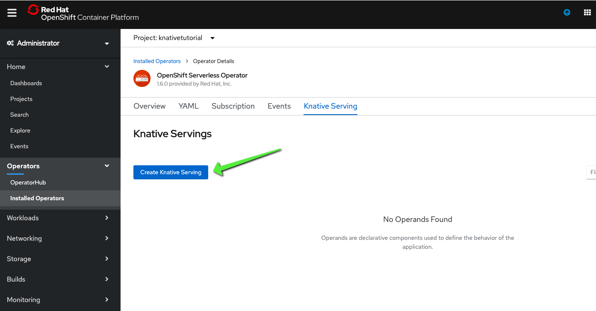
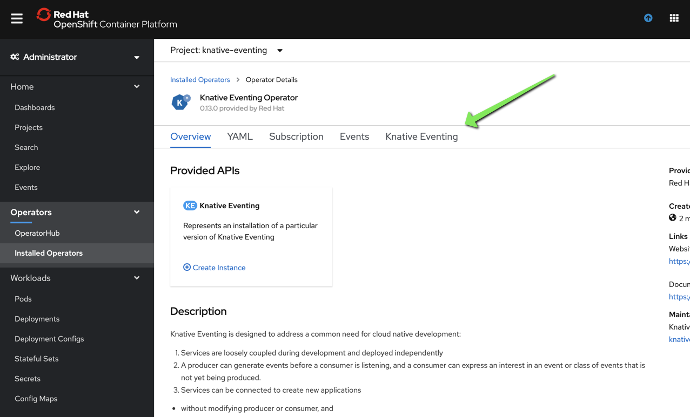

# Prerequisites

## Before you begin

Note that this exercise is taken from [Knative Tutorials by Kamesh Sampath](https://redhat-developer-demos.github.io/knative-tutorial/knative-tutorial/index.html "Open Knative Tutorials") and my goal is to make the Knative exercises easy to consume.

Make sure you check-out this repository from git and open it with [VSCode](https://code.visualstudio.com/).

Instructions are based on [VSCode Didact](https://github.com/redhat-developer/vscode-didact), so make sure it's installed
from the VSCode extensions marketplace.

From the VSCode UI, right-click on the `01-Knative-Prerequisites.didact.md` file and select "Didact: Start Didact tutorial from File". A new Didact tab will be opened in VS Code.

## Checking requirements

<a href='didact://?commandId=vscode.didact.validateAllRequirements' title='Validate all requirements!'><button>Validate all Requirements at Once!</button></a>

| Requirement (Click to Verify)  | Availability | Additional Information/Solution |
| :--- | :--- | :--- |
| [Java is accessible at the command line](didact://?commandId=vscode.didact.requirementCheck&text=java-requirements-status$$java%20-version$$OpenJDK&completion=Java%20is%20available%20on%20this%20system. "Tests to see if `java -version` returns a result"){.didact} 	| *Status: unknown*{#java-requirements-status} JDK11 or above required	| See [Installing OpenJDK11](https://developers.redhat.com/products/openjdk/download "Download OpenJDK11 on your system") and then restart VS Code
| [At least one folder exists in the workspace](didact://?commandId=vscode.didact.workspaceFolderExistsCheck&text=workspace-folder-status&completion=A%20valid%20folder%20exists%20in%20the%20workspace. "Ensure that at least one folder exists in the user workspace"){.didact} | *Status: unknown*{#workspace-folder-status} | Create a workspace folder (or [click here to create a temporary folder](didact://?commandId=vscode.didact.createWorkspaceFolder&completion=Created%20temporary%20folder%20in%20the%20workspace. "Create a temporary folder and add it to the workspace."){.didact}), close, and reopen the Didact window
| [GraalVM is accessible at the command line](didact://?commandId=vscode.didact.requirementCheck&text=graalvm-requirements-status$$lli%20--version$$GraalVM&completion=GraalVM%20is%20available%20on%20this%20system. "Tests to see if `lli -version` returns a result"){.didact} 	| *Status: unknown*{#graalvm-requirements-status} JDK11 or above required	| See [Installing GraalVM](https://www.graalvm.org/docs/getting-started/ "Get Started with GraalVM on your system") and then restart VS Code
| [jq is accessible at the command line](didact://?commandId=vscode.didact.requirementCheck&text=jq-requirements-status$$jq%20--version$$jq&completion=jq%20is%20available%20on%20this%20system. "Tests to see if `jq --version` returns a result"){.didact} 	| *Status: unknown*{#jq-requirements-status} jq is required	| See [Installing jq](https://stedolan.github.io/jq/ "Get Started with jq on your system") and then restart VS Code
| [yq is accessible at the command line](didact://?commandId=vscode.didact.requirementCheck&text=yq-requirements-status$$yq%20--version$$yq&completion=yq%20is%20available%20on%20this%20system. "Tests to see if `yq --version` returns a result"){.didact} 	| *Status: unknown*{#yq-requirements-status} yq is required	| See [Installing yq](https://github.com/mikefarah/yq "brew install yq") and then restart VS Code
| [httpie is accessible at the command line](didact://?commandId=vscode.didact.requirementCheck&text=httpie-requirements-status$$http%20--version$$2&completion=httpie%20is%20available%20on%20this%20system. "Tests to see if `http --version` returns a result"){.didact} 	| *Status: unknown*{#httpie-requirements-status} httpie is required	| See [Installing httpie](https://httpie.org/ "brew install httpie") and then restart VS Code
| [watch is accessible at the command line](didact://?commandId=vscode.didact.requirementCheck&text=watch-requirements-status$$watch%20--version$$watch&completion=watch%20is%20available%20on%20this%20system. "Tests to see if `watch --version` returns a result"){.didact} 	| *Status: unknown*{#watch-requirements-status} watch is required	| See [Installing watch](https://osxdaily.com/2010/08/22/install-watch-command-on-os-x/ "brew install watch") and then restart VS Code
| [Apache Maven is accessible at the command line](didact://?commandId=vscode.didact.requirementCheck&text=maven-requirements-status$$mvn%20--version$$Apache%20Maven&completion=Apache%20Maven%20is%20available%20on%20this%20system. "Tests to see if `mvn -version` returns a result"){.didact} 	| *Status: unknown*{#maven-requirements-status} MAVEN3.2 or above required	| See [Installing Apache Maven](https://maven.apache.org/install.html "Documentation on how to Install Apache Maven on your system") and then restart VS Code
| [VS Code Extension Pack for Apache Camel by Red Hat is installed](didact://?commandId=vscode.didact.extensionRequirementCheck&text=extension1-requirement-status$$redhat.apache-camel-extension-pack&completion=Camel%20extension%20pack%20available. "Checks the VS Code workspace to make sure the extension pack is installed"){.didact} | *Status: unknown*{#extension1-requirement-status} OPTIONAL	| [Click here to install](vscode:extension/redhat.apache-camel-extension-pack "Opens the extension page and provides an install link") 
| [Check if the Quarkus Tools for Visual Studio Code Extension Pack by Red Hat is installed](didact://?commandId=vscode.didact.extensionRequirementCheck&text=extension2-requirement-status$$redhat.vscode-quarkus&completion=Quarkus%20extension%20pack%20is%20available%20on%20this%20system. "Checks the VS Code workspace to make sure the extension pack is installed"){.didact} | *Status: unknown*{#extension2-requirement-status} | The Quarkus Tools for Visual Studio Code Extension Pack by Red Hat provides a collection of useful tools for Quarkus developers, such as code completion and integrated lifecycle management. You can install it from the VS Code Extensions marketplace. 
| [Check if docker is installed](didact://?commandId=vscode.didact.cliCommandSuccessful&text=docker-requirements-status$$docker%20help&completion=Checked%20docker%20tool%20availability "Tests to see if `docker help` returns a 0 return code"){.didact} | *Status: unknown*{#docker-requirements-status} set cpu=6, memory=8GB and swap=4GB | The Docker daemon is installed
| [Check if the OpenShift CLI ("oc") is installed](didact://?commandId=vscode.didact.cliCommandSuccessful&text=oc-requirements-status$$oc%20help&completion=Checked%20oc%20tool%20availability "Tests to see if `oc help` returns a 0 return code"){.didact} | *Status: unknown*{#oc-requirements-status} OPTIONAL | The OpenShift CLI tool ("oc") will be used to interact with the OpenShift cluster.
| [Check if stern is installed](didact://?commandId=vscode.didact.cliCommandSuccessful&text=stern-requirements-status$$stern%20--version&completion=Checked%20stern%20tool%20availability "Tests to see if `stern --version` returns a 0 return code"){.didact} | *Status: unknown*{#stern-requirements-status} OPTIONAL | stern will be used for log tailing, install it using "brew install stern"
| [Check if you're connected to an OpenShift cluster](didact://?commandId=vscode.didact.requirementCheck&text=cluster-requirements-status$$oc%20get%20project$$NAME&completion=OpenShift%20is%20connected. "Tests to see if `oc get projects` returns a result"){.didact} | *Status: unknown*{#cluster-requirements-status} OPTIONAL | You need to connect to an OpenShift cluster in order to run the examples.

## 2. Preparing a new OpenShift project

Open a terminal tab and type the following command:

```
oc project knativetutorial
```

([^ execute](didact://?commandId=vscode.didact.sendNamedTerminalAString&text=ocTerm$$oc%20project%20knativetutorial&completion=Use%20your%20namespace. "Opens a new terminal and sends the command above"){.didact})


## 3. Install OpenShift ServiceMesh Operator





## 4. Install OpenShift Serverless Operator

`oc create project knative-serving`







Click on the "Knative Serving Operator"





Give it 5 minutes, you should see the knative-serving operator in "Installed Operators"


Click on the "Knative serving" resource and scroll to the end


## 5. Install Knative-Eventing Operator


Click on the "Knative Eventing Operator"




## 6. Install Camel-K Operator


## 7. Install AMQ Streams Operator


