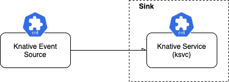

# Knative Eventing

## 1. CloudEvents
CloudEvents is a specification for describing event data in a common way. An event might be produced by any number of sources (e.g. Kafka, S3, GCP PubSub, MQTT) and as a software developer, you want a common abstraction for all event inputs.

## 2. Knative Eventing - Introduction

At the end of this chapter you will know and understand:

- What is an event source?

- What is a channel?

- What is a subscriber?

- What is a trigger?

- What is a broker?

- How to make a Knative serving service receive an event?

- How to make a service a subscriber of an event?

## 3. Usage Patterns
There are three primary usage patterns with Knative Eventing:

### 3.1 Source to Sink

Source to Service provides the simplest getting started experience with Knative Eventing. It provides single Sink — that is, event receiving service --, with no queuing, backpressure, and filtering. The Source to Service does not support replies, which means the response from the Sink service is ignored. As shown in the figure, the responsibility of the Event Source it just to deliver the message without waiting for the response from the Sink, hence I think it will be apt to compare Source to Sink to fire and forget messaging pattern.

### 3.2 Channel and Subscription

With the Channel and Subscription, the Knative Eventing system defines a Channel, which can connect to various backends such as In-Memory, Kafka and GCP PubSub for sourcing the events. Each Channel can have one more subscribers in the form of Sink services as shown in the figure, which can receive the event messages and process them as needed. Each message from the Channel is formatted as CloudEvent and sent further up in the chain to other Subscribers for further processing. The Channels and Subscription usage pattern does not have the ability to filter messages.

### 3.3 Broker and Trigger

The Broker and Trigger are similar to Channel and Subscription, except that they support filtering of events. Event filtering is a method that allows the subscribers to show an interest on certain set of messages that flows into the Broker. For each Broker, Knative Eventing will implicitly create a Knative Eventing Channel. As shown in the figure, the Trigger gets itself subscribed to the Broker and applies the filter on the messages on its subscribed broker. The filters are applied on the on the Cloud Event attributes of the messages, before delivering it to the interested Sink Services(subscribers).

