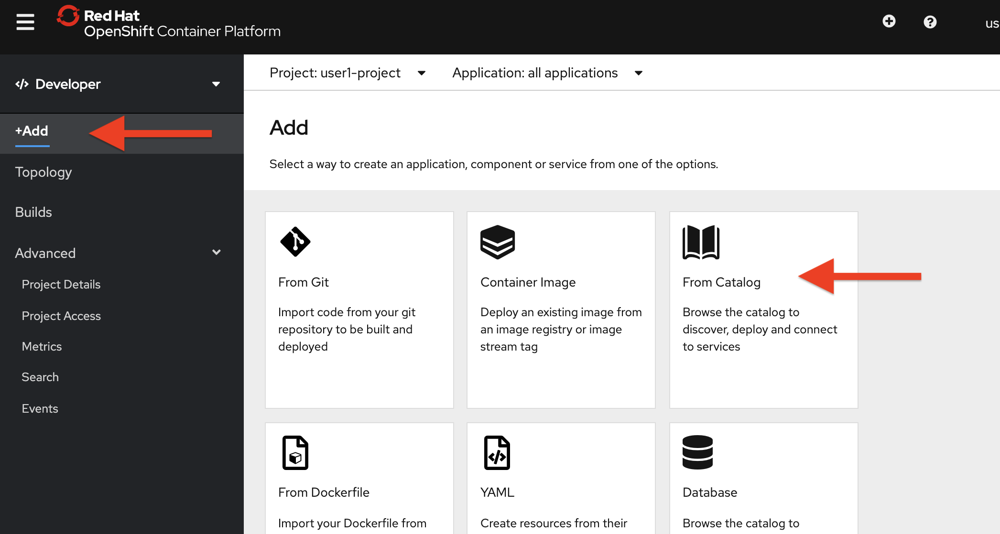
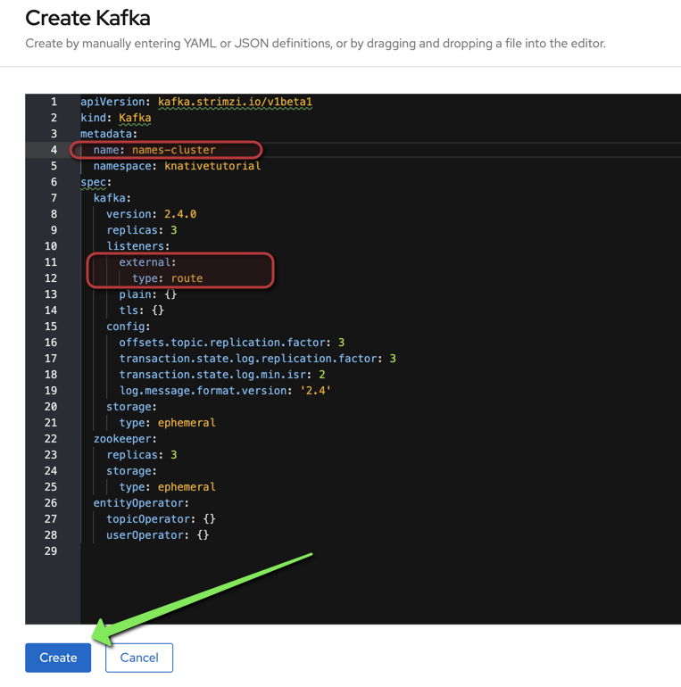
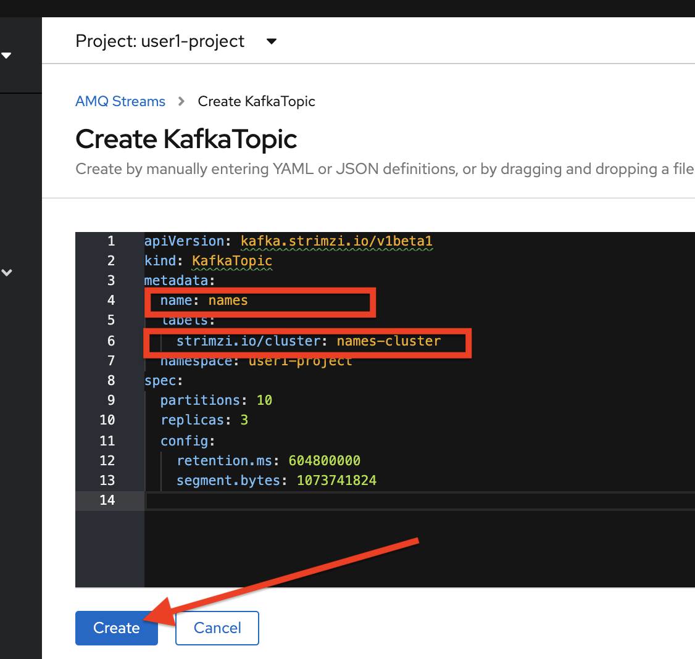
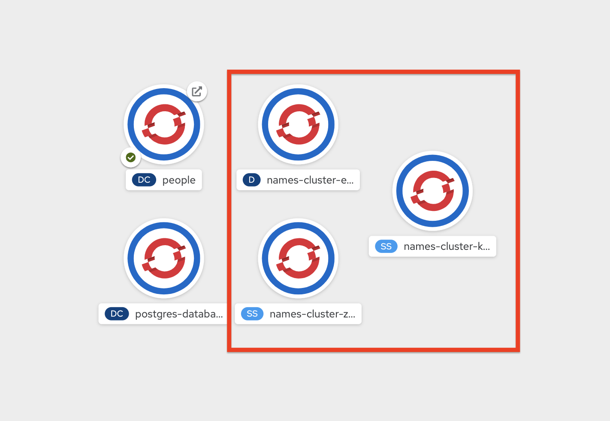

# Knative Advanced Tutorial

In this exercise, you will use `Apache Kafka`, a distributed streaming platform. You will also use `Strimzi`, which provides an easy way to run an Apache Kafka cluster on Kubernetes using `Operators`.

## 1. What is Apache Kafka?

Apache Kafka is a distributed streaming platform. A streaming platform has three key capabilities:

- Publish and subscribe to streams of records, similar to a message queue or enterprise messaging system.

- Store streams of records in a fault-tolerant durable way.

- Process streams of records as they occur.

- Kafka is generally used for two broad classes of applications:

- Building real-time streaming data pipelines that reliably get data between systems or applications

- Building real-time streaming applications that transform or react to the streams of data

## 2. What is Strimzi?

Strimzi provides a way to run an Apache Kafka cluster on Kubernetes in various deployment configurations.

Strimzi is based on Apache Kafka, and makes it easy to run Apache Kafka on OpenShift or Kubernetes.

Strimzi provides three operators:

- **Cluster Operator** - Responsible for deploying and managing Apache Kafka clusters within an OpenShift or Kubernetes cluster.

- **Topic Operator** - Responsible for managing Kafka topics within a Kafka cluster running within an OpenShift or Kubernetes cluster.

- **User Operator** - Responsible for managing Kafka users within a Kafka cluster running within an OpenShift or Kubernetes cluster.

## 3. The Goal

In this exercise, we are going to generate (random) names in one component. These names are written in a Kafka topic (`names`). A second component reads from the `names` Kafka topic and applies some magic conversion to the name (adding an honorific). The result is sent to an in-memory stream consumed by a JAX-RS resource. The data is sent to a browser using `server-sent events` and displayed in the browser. It will look like this:

Open a terminal tab and type the following command:

```
oc project knativetutorial
```

([^ execute](didact://?commandId=vscode.didact.sendNamedTerminalAString&text=ocTerm$$oc%20project%20kameldemo&completion=Use%20your%20namespace. "Opens a new terminal and sends the command above"){.didact})

## 4. Create Kafka Cluster

The Strimzi operator installs and manages Kafka clusters on Kubernetes. You can go to "Operator Hub" and install the AMQ-Streams operator very easily. 
Open [the AMQ-Streams blog](https://middlewareblog.redhat.com/2019/12/10/getting-started-with-the-red-hat-amq-streams-operator/) in your browser. 

First, on the OpenShift Developer view, click **+Add** and, then From Catalog:



Type in `kafka` in the keyword filter box:


These are all of the Kafka cluster elements you can install. Click on **Kafka**, and then click on **Create**. This will open a yaml file for you to configure the cluster before it’s installed. Leave all other values as-is, and click **Create**:



This will create a new Kafka Kubernetes object in your namespace, triggering the Operator to deploy Kafka.

## 5. Create Kafka Topic

Follow the same process to create a Kafka Topic:

Click **+Add** on the left again, select **From Catalog**, and enter `topic` into the search box. Click on the *Kafka Topic* box, then click **Create**:


We’ll need to create a topic for our application to stream to and from, so in the YAML:

Then click **Create**.



This will cause the Operator to provision a new Topic in the Kafka cluster.

Back on the OpenShift console, Developer view, make sure all the Kafka and Zookeeper pods are up and running (with dark blue circles):



It may take a few minutes for all of the pods to appear spin up. You can continue to the next step while the Kafka cluster and topics are created.

