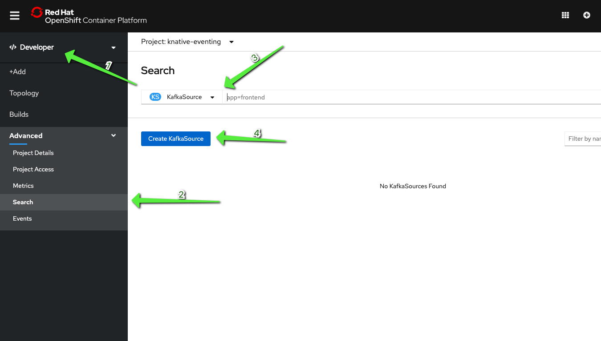
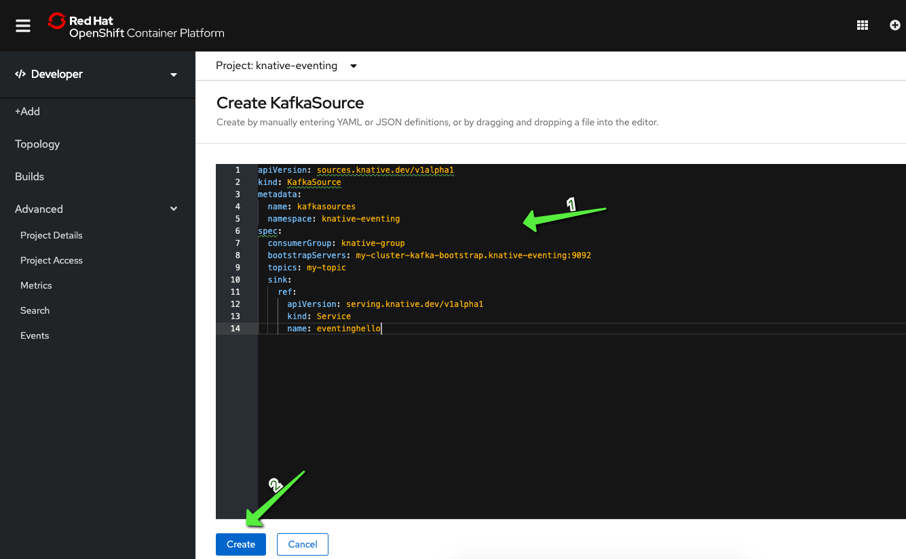

# Apache Kafka Events with Knative Eventing

At the end of this chapter you will be able to:

- Using KafkaSource with Knative Eventing

- Source Kafka Events to Sink

- Autocaling Knative Services with Apache Kafka Events

## 1. Prerequisite

- Make sure you completed all the steps in the Prerequistes lab

- Make sure the Kafka cluster is setup on OpenShift

## 2. Deploy Knative Eventing KafkaSource

Make sure to be on `knative-eventing` OpenShift project

Open a terminal tab and type the following command:

```
oc project knative-eventing
```

([^ execute](didact://?commandId=vscode.didact.sendNamedTerminalAString&text=ocTerm$$oc%20project%20knative-eventing&completion=Use%20your%20namespace. "Opens a new terminal and sends the command above"){.didact})

Deploy Knative Eventing KafkaSource : This need to be used to have the Kafka messages to flow through the Knative Eventing Channels. Use the OperatorHub in OpenShift web console to install Knative Eventing Kafka operator that will install the KafkaSource.

You can get more information from [Knative Apache Kafka Operator](https://openshift-knative.github.io/docs/docs/proc_apache-kafka.html "Install Knative Apache Kafka Operator").

Verify that `knative-eventing` namespace includes the `kafka-controller-manager-0` pod:

```
oc get pods -n knative-eventing
```
([^ execute](didact://?commandId=vscode.didact.sendNamedTerminalAString&text=ocTerm$$oc%20get%20pods%20-n%20knative-eventing&completion=Run%20oc%20get%20pods%20command. "Opens a new terminal and sends the command above"){.didact})

When you run the operator, you should also deploy the Knative Kafka Channel that can be used to connect the Knative Eventing Channel with a Apache Kafka cluster backend.

The command above should show the following output:
```
NAME                                        READY   STATUS    RESTARTS   AGE
broker-controller-77dcf77b7f-wvgdr          1/1     Running   1          3d
eventing-controller-b478d6dd5-h2xxz         1/1     Running   1          3d
eventing-webhook-85dfb55fb-kt249            1/1     Running   1          3d
imc-controller-855f5cf459-fml47             1/1     Running   1          3d
imc-dispatcher-8679b98ff7-4qrp6             1/1     Running   1          3d
kafka-ch-controller-57cf94b477-sf26c        1/1     Running   0          7h51m
kafka-controller-manager-56d58bb444-bfvch   1/1     Running   0          7h51m
kafka-webhook-77b75f7c7f-c7crr              1/1     Running   0          7h51m
```

Now, make sure to be on knativetutorial OpenShift project

Open a terminal tab and type the following command:

```
oc project knativetutorial
```

([^ execute](didact://?commandId=vscode.didact.sendNamedTerminalAString&text=ocTerm$$oc%20project%20kameldemo&completion=Use%20your%20namespace. "Opens a new terminal and sends the command above"){.didact})
Deploy the `kafkasource` now using the steps below in the `knativetutorial` namespace





You should also find some api-resources as shown:

```
oc api-resources --api-group='sources.eventing.knative.dev'
```
([^ execute](didact://?commandId=vscode.didact.sendNamedTerminalAString&text=ocTerm$$oc%20api-resources%20--api-group='sources.eventing.knative.dev'&completion=oc%20api-resources%20command. "Opens a new terminal and sends the command above"){.didact})


The command should show the following APIs in sources.eventing.knative.dev :
```
NAME               APIGROUP                       NAMESPACED  KIND
apiserversources   sources.eventing.knative.dev   true        ApiServerSource
containersources   sources.eventing.knative.dev   true        ContainerSource
cronjobsources     sources.eventing.knative.dev   true        CronJobSource
sinkbindings       sources.eventing.knative.dev   true        SinkBinding
```

```
oc api-resources --api-group='messaging.knative.dev'
```
([^ execute](didact://?commandId=vscode.didact.sendNamedTerminalAString&text=ocTerm$$oc%20api-resources%20--api-group='messaging.knative.dev'&completion=oc%20api-resources%20command. "Opens a new terminal and sends the command above"){.didact})

The command should show the following APIs in messaging.knative.dev :

```
NAME               SHORTNAMES   APIGROUP                NAMESPACED   KIND
channels           ch           messaging.knative.dev   true         Channel
inmemorychannels   imc          messaging.knative.dev   true         InMemoryChannel
kafkachannels      kc           messaging.knative.dev   true         KafkaChannel
subscriptions      sub          messaging.knative.dev   true         Subscription
```

## 3. Using Kafka Channel as Default Knative Channel

Persistence and Durability are two very important features of any messaging based architectures. The Knative Channel has built-in support for durability. Durability of messages becomes ineffective, if the Knative Eventing Channel does not support persistence. As without persistence it will not be able to deliver the messages to subscribers which might be offline at the time of message delivery.

By default all Knative Channels created by the Knative Eventing API use InMemoryChannel(imc), which does not have capability to persist messages. To enable persistence we need to use one of the supported channels such as GCP PubSub, Kafka or Natss as the default Knative Channel backend.

We installed Apache Kafka, earlier in this tutorial, let us now configure it to be the default Knative Channel backend:

Check out the Knative `eventing/default-kafka-channel-new.yaml` ([open](didact://?commandId=vscode.openFolder&projectFilePath=eventing/default-kafka-channel-new.yaml&completion=Opened%20the%20eventing/default-kafka-channel-new.yaml%20file "Opens the eventing/default-kafka-channel-new.yaml file"){.didact})

```
oc apply -f eventing/default-kafka-channel-new.yaml
```
([^ execute](didact://?commandId=vscode.didact.sendNamedTerminalAString&text=ocTerm$$oc%20apply%20-n%20knativetutorial%20-f%20eventing/default-kafka-channel-new.yaml&completion=Run%20oc%20apply%20command. "Opens a new terminal and sends the command above"){.didact})

Since you have now made all Knative Eventing Channels of knativetutorial to be KafkaChannel, creating a Knative Eventing Channel in namespace knativetutorial will result in a corresponding Kafka Topic created. Let us now verify it by creating a sample Channel as show in listing,

Create an example Channel (copy and run it on terminal/command prompt)
```
cat <<EOF | kubectl apply -f -
apiVersion: messaging.knative.dev/v1alpha1
kind: Channel
metadata:
  name: my-events-ch
  namespace: knativetutorial
spec: {}
EOF
```

When you now list the topics that are available in Kafka using the script `bin/kafka-list-topics.sh`, you should see a topic corresponding to your Channel `my-events-ch`:

```
bin/kafka-list-topics.sh
```
([^ execute](didact://?commandId=vscode.didact.sendNamedTerminalAString&text=ocTerm$$bin/kafka-list-topics.sh&completion=Run%20sh%20command. "Opens a new terminal and sends the command above"){.didact})

The command should return an output like `knative-messaging-kafka.knativetutorial.my-events-ch`.

For each Knative Eventing Channel that you will create, there will be a Kafka Topic created, the topic’s name will follow a convention like knative-messaging-kafka.<your-channel-namespace>.<your-channel-name>.

We can delete the example my-events-ch channel using the command:
```
oc -n knativetutorial delete -f channels.messaging.knative.dev my-events-ch
```
([^ execute](didact://?commandId=vscode.didact.sendNamedTerminalAString&text=ocTerm$$oc%20-n%20knativetutorial%20delete%20-f%20channels.messaging.knative.dev%20my-events-ch&completion=Run%20oc%20delete%20command. "Opens a new terminal and sends the command above"){.didact})

## 4. Connecting Kafka Source to Sink
Now, all of your infrastructure is configured, you can deploy the Knative Serving Service(sink) by running the command:

```
oc apply -n knativetutorial -f eventing/eventing-hello-sink.yaml
```
([^ execute](didact://?commandId=vscode.didact.sendNamedTerminalAString&text=ocTerm$$oc%20apply%20-n%20knativetutorial%20-f%20eventing/eventing-hello-sink.yaml&completion=Run%20oc%20apply%20command. "Opens a new terminal and sends the command above"){.didact})

Check the Knative Service that was created by the command above:
```
oc get ksvc
```
([^ execute](didact://?commandId=vscode.didact.sendNamedTerminalAString&text=ocTerm$$oc%20-n%20knativetutorial%20get%20ksvc&completion=Run%20oc%20get%20command. "Opens a new terminal and sends the command above"){.didact})

The command should show an output like:
```
NAME            URL                                      READY
eventinghello   http://eventinghello.kafka.example.com   True
```

Make sure to follow the logs using stern:

```
stern eventinghello -c user-container
```
([^ execute](didact://?commandId=vscode.didact.sendNamedTerminalAString&text=curlTerm$$stern%20eventinghello%20-c%20user-container&completion=Run%20stern%20command. "Opens a new terminal and sends the command above"){.didact})

The initial deployment of `eventinghello` will cause it to scale up to 1 pod. It will be around until it hits its scale-down time limit. Allow it to scale down to zero pods before continuing.

Create a KafkaSource for `my-topic` by connecting your Kafka topic `my-topic` to `eventinghello`:

```
apiVersion: sources.eventing.knative.dev/v1alpha1
kind: KafkaSource
metadata:
  name: mykafka-source
spec:
  consumerGroup: knative-group
  bootstrapServers: my-cluster-kafka-bootstrap.kafka:9092 
  topics: my-topic 
  sink: 
    ref:
      apiVersion: serving.knative.dev/v1
      kind: Service
      name: eventinghello
```

"my-cluster-kafka-bootstrap:9092" can be found via kubectl get -n kafka services or oc get -n kafka services

my-topic was created earlier section when deploying Apache Kafka
This is another example of a direct Source to Sink

The deployment of KafkaSource will result in a new pod prefixed with "mykafka-source".

```
oc -n knativetutorial apply -f mykafka-source.yaml
```
Give it a few seconds and run
```
oc get pods
```
When the KafkaSource is ready it will show the following output:

```
NAME                                          READY  STATUS   RESTARTS  AGE
mykafka-source-vxs2k-56548756cc-j7m7v         1/1    Running  0         11s
```

Since we had test messages of "one", "two" and "three" from earlier you might see the eventinghello service awaken to process those messages.

Wait for eventinghello to scale down to zero pods before moving on then push more Kafka messages into `my-topic`.

```
bin/kafka-producer.sh
```

And then enter the following JSON-formatted messages:

```
{"hello":"world"}

{"hola":"mundo"}

{"bonjour":"le monde"}

{"hey": "duniya"}
```

Knative Eventing events through the Kafka Source must be JSON formatted

While making sure to monitor the logs of the eventinghello pod:

```
stern eventinghello -c user-container
```

```
ce-id=partition:1/offset:1
ce-source=/apis/v1/namespaces/kafka/kafkasources/mykafka-source#my-topic
ce-specversion=1.0
ce-time=2020-01-01T01:16:12.886Z
ce-type=dev.knative.kafka.event
content-type=application/json
content-length=17
POST:{"hey": "duniya"}
The sample output has been modified for readability and formatting reasons. You can see the logging output of all your JSON-based event input in the terminal where you are watching the eventinghello logs.
```

## 7. Cleanup

```
oc delete -n knativetutorial  -f eventing/mykafka-source.yaml
```
([^ execute](didact://?commandId=vscode.didact.sendNamedTerminalAString&text=ocTerm$$oc%20-n%20knativetutorial%20delete%20-f%20eventing/mykafka-source.yaml&completion=Run%20oc%20delete%20command. "Opens a new terminal and sends the command above"){.didact})
```
oc delete -n knativetutorial  -f eventing/eventing-hello-sink.yaml
```
([^ execute](didact://?commandId=vscode.didact.sendNamedTerminalAString&text=ocTerm$$oc%20-n%20knativetutorial%20delete%20-f%20eventing/eventing-hello-sink.yaml&completion=Run%20oc%20delete%20command. "Opens a new terminal and sends the command above"){.didact})
```
oc delete -n kafka -f eventing/kafka-topic-my-topic.yaml
```
([^ execute](didact://?commandId=vscode.didact.sendNamedTerminalAString&text=ocTerm$$oc%20-n%20knativetutorial%20delete%20-f%20eventing/kafka-topic-my-topic.yaml&completion=Run%20oc%20delete%20command. "Opens a new terminal and sends the command above"){.didact})

