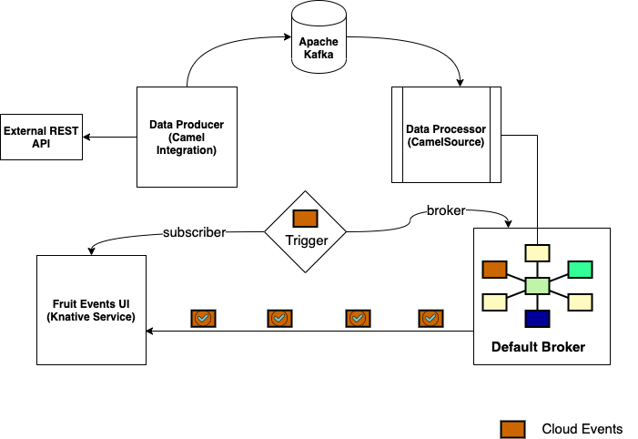

# Applying Content Based Routing EIP

At the end of this chapter you will be able to:

- How to run integrate Apache Kafka and Camel-K

- Apply Content Based Routing (CBR) Enterprise Integration Pattern(EIP)

- Apache Camel supports numerous Enterprise Integration Patterns (EIPs) out-of-the-box, you can find the complete list of patterns on the Apache Camel website.

> **Content Based Router**
> The Content Based Router examines the message content and routes the message to a different channel based on the data contained in the message. The routing can be based on a number of criteria such as existence of fields, specific field values etc. When implementing a Content Based Router, special caution should be taken to make the routing function easy to maintain as the router can become a point of frequent maintenance. In more sophisticated integration scenarios, the Content Based Router can take on the form of a configurable rules engine that computes the destination channel based on a set of configurable rules. [1]

## 1. Prerequisites

Make sure you completed all the steps in the Prerequistes lab.

Use `oc` client on your terminal to navigate to `knativetutorial` project

```
oc project knativetutorial
```
([^ execute](didact://?commandId=vscode.didact.sendNamedTerminalAString&text=ocTerm$$oc%20project%20knativetutorial&completion=Run%20oc%20project%20command. "Opens a new terminal and sends the command above"){.didact})

Just make sure:

- Review Knative Eventing module to refresh the concepts

- Apache Kafka my-cluster is running

- Camel-K operator is installed (as shown in the prerequisites lab)

## 2. Application Overview

We will deploy a simple data streaming application that will use Camel-K and Knative to process the incoming data where that processed data is pushed out to to a reactive web application via Server-Sent Events (SSE) as shown below:



The application has following components,

- **Data Producer**: The Camel-K integration application, that will produce data simulating the streaming data by sending the data to Apache Kafka

- **Data Processor**: The Camel-K integration application, that will process the streaming data from Kafka and send the default Knative Eventing Broker

- **Event Subscriber(Fruits UI)**: The Quarkus Java application, that will display the processed data from the Data Processor

- **Event Trigger**: This is Knative Event Trigger that apply a filter on the processed data, to send to the Event Subscriber

The upcoming recipes will deploy these individual components and finally we test the integration by wiring them all together.

## 3. Label Namespace

The `knativetutorial` namespace is labeled to inject Knative Eventing’s default Broker filter and ingress deployment.
```
oc label namespace knativetutorial knative-eventing-injection=enabled
```
([^ execute](didact://?commandId=vscode.didact.sendNamedTerminalAString&text=ocTerm$$kubectl%20label%20namespace%20knativetutorial%20knative-eventing-injection=enabled&completion=Run%20kubectl%20command. "Opens a new terminal and sends the command above"){.didact})

Verify that the default broker is running:

```
watch oc --namespace knativetutorial get broker
```
([^ execute](didact://?commandId=vscode.didact.sendNamedTerminalAString&text=ocTerm$$watch%20oc%20-n%20knativetutorial%20get%20broker&completion=Run%20oc%20get%20pods%20command. "Opens a new terminal and sends the command above"){.didact})


Running command above should show an output like:
```
NAME     READY REASON URL                                                 AGE
default  True         http://default-broker.knativetutorial.svc.cluster.local   22s
```
**To exit and terminate the execution**, [just click here](didact://?commandId=vscode.didact.sendNamedTerminalCtrlC&text=ocTerm&completion=loop%20interrupted. "Interrupt the current operation on the terminal"){.didact}

or hit `ctrl+c` on the terminal window.

This will also start two additional pods namely `default-broker-filter` and `default-broker-ingress` :

```
watch -n knativetutorial oc get pods
```
([^ execute](didact://?commandId=vscode.didact.sendNamedTerminalAString&text=ocTerm$$watch%20oc%20-n%20knativetutorial%20get%20pods&completion=Run%20oc%20get%20pods%20command. "Opens a new terminal and sends the command above"){.didact})

**To exit and terminate the execution**, [just click here](didact://?commandId=vscode.didact.sendNamedTerminalCtrlC&text=ocTerm&completion=loop%20interrupted. "Interrupt the current operation on the terminal"){.didact}

or hit `ctrl+c` on the terminal window.

Running command above should show the following pods in `knativetutorial`:
```
NAME                                       READY   STATUS      AGE
default-broker-filter-c6654bccf-zkw7s      1/1     Running     59s
default-broker-ingress-857698bc5b-r4zmf    1/1     Running     59s
```

## 3. Deploy Data Producer

Knative Camel-K integration called fruits-producer which will use a public fruits API to retrieve the information about fruits and stream the data to Apache Kafka. The fruits-producer service retrieves the data from the fruits API, splits it using the Split EIP and then sends the data to a Kafka topic called fruits.

Check out the Knative `advanced/camel-k/eip/fruits-producer.yaml` ([open](didact://?commandId=vscode.openFolder&projectFilePath=advanced/camel-k/eip/fruits-producer.yaml&completion=Opened%20the%20advanced/camel-k/eip/fruits-producer.yaml%20file "Opens the advanced/camel-k/eip/fruits-producer.yaml file"){.didact}):

You notice the following functionality
- Call the external REST API http://fruityvice.com to get the list of fruits to simulate the data streaming
- Apply the Camel Split EIP to split the JSON array to individual records
- Send the processed data i.e. the individual fruit record as JSON to Apache Kafka Topic

Run the following command to deploy the `fruit-producer` integration:

```
kamel -n knativetutorial run \
 --wait \
 --dependency camel:log \
 --dependency camel:jackson \
 --dependency camel:jsonpath \
  advanced/camel-k/eip/fruits-producer.yaml
```
([^ execute](didact://?commandId=vscode.didact.sendNamedTerminalAString&text=knTerm$$kamel%20-n%20knativetutorial%20run%20--wait%20--dependency%20camel%3Alog%20--dependency%20camel%3Ajackson%20--dependency%20camel%3Ajsonpath%20advanced%2Fcamel-k%2Feip%2Ffruits-producer.yaml&completion=Run%20kamel%20command. "Opens a new terminal and sends the command above"){.didact})

> The service deployment may take several minutes to become available, to monitor the status:
>
> - watch kubectl get pods or watch oc get pods
>
> - watch kamel get
>
> - watch kubectl get ksvc or watch oc get ksvc

```
watch oc -n knativetutorial get pods
```
([^ execute](didact://?commandId=vscode.didact.sendNamedTerminalAString&text=ocTerm$$watch%20oc%20-n%20knativetutorial%20get%20pods&completion=Run%20oc%20get%20pods%20command. "Opens a new terminal and sends the command above"){.didact})

**To exit and terminate the execution**, [just click here](didact://?commandId=vscode.didact.sendNamedTerminalCtrlC&text=ocTerm&completion=loop%20interrupted. "Interrupt the current operation on the terminal"){.didact}

or hit `ctrl+c` on the terminal window.

A successful deploy will show the following pods:
```
NAME                                                READY   STATUS    AGE
camel-k-operator-5d74595cdf-4v9qz                   1/1     Running   4h4m
default-broker-filter-c6654bccf-zkw7s               1/1     Running   5m
default-broker-ingress-857698bc5b-r4zmf             1/1     Running   5m
fruits-producer-nfngm-deployment-759c797c44-d6r52   2/2     Running   70s
```
Lets have a look at the knative services too
```
oc -n knativetutorial get ksvc
```
([^ execute](didact://?commandId=vscode.didact.sendNamedTerminalAString&text=ocTerm$$oc%20-n%20knativetutorial%20get%20ksvc&completion=Run%20oc%20get%20ksvc%20command. "Opens a new terminal and sends the command above"){.didact})

```
NAME              URL                                            READY
event-display     http://event-display.knativetutorial.example.com     True
fruits-producer   http://fruits-producer.knativetutorial.example.com   True
```

## 4. Verify Fruit Producer

Run the `bin/call.sh` with the parameter fruits-producer.

```
bin/call.sh fruits-producer ''
```
Open a new terminal and run the start Kafka consumer using the script $TUTORIAL_HOME/bin/kafka-consumer.sh with parameter names:

$TUTORIAL_HOME/bin/kafka-consumer.sh names

If the fruit-producer executed well then you should the Kafka Consumer terminal show something like:

{"genus":"Citrullus","name":"Watermelon","id":25,"family":"Cucurbitaceae","order":"Cucurbitales","nutritions":{"carbohydrates":8,"protein":0.6,"fat":0.2,"calories":30,"sugar":6}}
Since the fruits API returns a static set of fruit data consistently, you can call it as needed to simulate data streaming and it will always be the same data.

Deploy Data Processor
Let us now deploy a CamelSource called fruits-processor, that can handle and process the streaming data from the Kafka topic fruits. The fruits-processor CamelSource applies the Content Based Router EIP to process the data. The following listing describes the fruits-processor CamelSource:

CamelSource fruits-processor
apiVersion: sources.eventing.knative.dev/v1alpha1
kind: CamelSource
metadata:
  name: fruits-processor
spec:
  source:
    integration:
      dependencies:
        - camel:log
        - camel:kafka
        - camel:jackson
        - camel:bean
    flow:
      from:
        uri: "kafka:fruits?brokers=my-cluster-kafka-bootstrap.kafka:9092" 
        steps:
          - log:
              message: "Received Body ${body}"
          - unmarshal:
              json: {} 
          - choice: 
              when:
                - simple: "${body[nutritions][sugar]} <= 5"
                  steps:
                    - remove-headers: "*"
                    - marshal:
                        json: {}
                    - set-header: 
                        name: ce-type
                        constant: low-sugar
                    - set-header:
                        name: fruit-sugar-level
                        constant: low
                    - to: "log:low?showAll=true&multiline=true"
                - simple: "${body[nutritions][sugar]} > 5 || ${body[nutritions][sugar]} <= 10"
                  steps:
                    - remove-headers: "*"
                    - marshal:
                        json: {}
                    - set-header:
                        name: ce-type
                        constant: medium-sugar
                    - set-header:
                        name: fruit-sugar-level
                        constant: medium
                    - to: "log:medium?showAll=true&multiline=true"
              otherwise:
                steps:
                  - remove-headers: "*"
                  - marshal:
                      json: {}
                  - set-header:
                      name: ce-type
                      constant: high-sugar
                  - set-header:
                      name: fruit-sugar-level
                      constant: high
                  - to: "log:high?showAll=true&multiline=true"
  sink: 
    ref:
      apiVersion: eventing.knative.dev/v1alpha1
      kind: Broker
      name: default
The Camel route connects to Apache Kakfa broker and the topic fruits.
Once the data is received it is transformed into a JSON payload.
The Content Based Router pattern using the Choice EIP. In the data processing you classify the fruits as low (sugar <= 5), medium(sugar between 5 to 10) and high(sugar > 10) based on the sugar level present in their nutritions data.
Based on the data classification you will be setting the CloudEvents type header to be low-high, medium-sugar and high-sugar. This header is used as one of the filter attributes in the Knative Eventing Trigger.
The last step is to send the processed data to the Knative Eventing Broker named default.
kubectl

oc

oc apply -n knativetutorial -f eip/fruits-processor.yaml

As the Camel-K controller takes few minutes to deploy the CamelSource, you can watch the pods of the knativetutorial namespace for its status:

kubectl

oc

watch oc -n knativetutorial get pods

fruit-processor Knative service pods
NAME                                      READY   STATUS    AGE
camel-k-operator-5d74595cdf-4v9qz         1/1     Running   4h17m
default-broker-filter-c6654bccf-zkw7s     1/1     Running   18m
default-broker-ingress-857698bc5b-r4zmf   1/1     Running   18m
fruits-processor-h45f7-6fdfd74cf9-nmfkn   1/1     Running   29s
A successful fruit-processor is deploy will show the following pods in knativetutorial

Wondering why fruit-producer is not listed ?

fruit-producer is a Knative service, hence it wil be scaled down to zero in 60-90 seconds.

kubectl

oc

watch oc get  -n knativetutorial camelsources

When the CamelSource deployment is successful you will see it in READY state as shown:

NAME               READY   REASON   AGE
fruits-processor   True             2m22s
Deploy Event Subscriber
Let us now deploy a Reactive Web application called fruit-events-display`. It is a Quarkus Java application, that will update UI(reactively) as and when it receives the processed data from the Knative Eventing backend.

You can deploy the fruit-events-display application using the command:

kubectl

oc

oc apply -n knativetutorial \
  -f $TUTORIAL_HOME/install/utils/fruit-events-display.yaml

Verify if the fruit-events-display application is up and running:

kubectl

oc

watch oc -n knativetutorial get pods

Once the fruit-events-display is running you will see the following pods in the knativetutorial:

Pods list
NAME                                       READY   STATUS    AGE
camel-k-operator-5d74595cdf-4v9qz          1/1     Running   4h21m
default-broker-filter-c6654bccf-zkw7s      1/1     Running   22m
default-broker-ingress-857698bc5b-r4zmf    1/1     Running   22m
fruit-events-display-8d47bc98f-6r7zt       1/1     Running   15s
fruits-processor-h45f7-6fdfd74cf9-nmfkn    1/1     Running   4m12s
The web fruit-events-display application will refresh its UI as and when it receives the processed data, you need you open the web application in your browser.

Minikube

OpenShift

oc expose -n knativetutorial service fruit-events-display

Once you have exposed the service, you can open the OpenShift route in the web browser:

oc get -n knativetutorial route fruit-events-display

The fruit-events-display UI will be empty as shown below:

cbr app ui empty
Figure 2. Fruit events Display Web Application
Apply Knative Filter
As a last step let us now deploy a Knative Event Trigger called fruits-trigger. The trigger consumes the events from the Knative Event Broker named default, when the fruit event is received it will dispatch the events to the subscriber — that is fruit-events-display service --.

apiVersion: eventing.knative.dev/v1alpha1
kind: Trigger
metadata:
  name: sugary-fruits
spec:
  broker: default 
  filter: 
    attributes:
      type: low-sugar
  subscriber: 
    ref:
      apiVersion: v1
      kind: Service
      name: fruit-events-display
The Knative Event Broker that this Trigger listens to for Knative events. Events originate from the CamelSource called fruits-processor and are sent to the Knative Eventing Broker named default.
The filter attribute restricts the events that fruit-events-display will receive. In this example, it is configured to filter the events for the type low-sugar. You could also use the other classifications of fruits such as medium-sugar or high-sugar.
Set the subscriber as the fruit-events-display Kubernetes service to receive the filtered event data.
You can deploy the Knative Event Trigger using the following command:

kubectl

oc

oc apply -n knativetutorial -f eip/sugary-fruits.yaml

Let us check the status of the Trigger using the command kubectl -n knativetutorial get triggers which should return one trigger called sugary-fruits with ready state as shown below.

kubectl

oc

oc -n knativetutorial get triggers

As the trigger will dispatch its filtered event to fruit-events-display , the subscriber URI of the Trigger will be that of fruit-events-display service.

NAME           READY BROKER    SUBSCRIBER_URI
sugary-fruits  True  default   http://fruits-events-display.knativetutorial.svc.cluster.local/
Verify end to end
Now that we have all the components for the Application Overview, let us verify the end to end flow:

To verify the data flow and processing call the fruits-producer service using the script $TUTORIAL_HOME/bin/call.sh with parameters fruits-producer and ''.

$TUTORIAL_HOME/bin/call.sh fruits-producer ''

Assuming everything worked well, you should see the low-sugar fruits listed in the fruits-event-display as shown below:

cbr app ui with data
Figure 3. Fruit events
Cleanup
kubectl

oc

kamel delete  -n knativetutorial fruit-producer
oc delete  -n knativetutorial -f -f eip/fruits-processor.yaml
oc delete -n knativetutorial -f $TUTORIAL_HOME/install/utils/fruit-events-display.yaml
